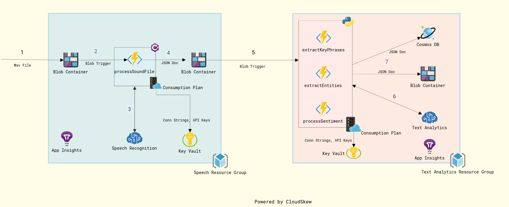

# Sample Application leveraging Azure Cognitive and Serverless capabilities

## Introduction

This repo contains a simple example of how Serverless computing along with AI (Cognitive services) on Azure can be leveraged to create a powerful, scalable solution for processing data. The solution is laid out as follows:

1) An audio file (WAV) is uploaded to an Azure blob container (possibly by an app). For example, the audio file represents notes from a COVID-19 warrior at a testing facility.
2) An Azure function (processSoundFile) is triggered through a blob trigger
3) The function uses Azure Speech Recognition SDK to get a text transcription from the audio file
4) The output is pushed to another blob container as a JSON file.
5) This in turn triggers three more Azure functions through blob triggers
6) Each function individually perform the following text analytics on this file leveraging the following Cognitive services:
   1) Entity Recognition
   2) Key Phrase Extraction
   3) Processes the sentiment of the text
7) The output of text analytics is pushed to Azure CosmosDB and another blob container as JSON documents.

This repo has the following structure:

## Infrastructure as Code

The infra folder has ARM templates to setup the services required to run the sample. There is no Pipeline YAML provided in this sample. In this sample, Speech Recognition and Text Analytics Azure functions are setup in separate resource groups (as they are configured as consumption plans)

Note : The ARM templates don't setup the functions themselves, just the App Service Plan, Storage etc. You can deploy the functions using VS Code or [Azure Functions Core Tools](https://github.com/Azure/azure-functions-core-tools) CLI. Please note this repo does not have the bells and whistles of a production-grade setup.

## Speech Recognition

The Azure function `ProcessSoundFile` does Speech Recognition is written using C# and .NET Core 3.1. It is configured with a `BlobTrigger` and has a `Blob` output

### Speech Recognition Function Configuration

The following are the required additional configuration settings required by the function. Sensitive information like Cognitive Services API Keys and Connection string for Storage accounts can be stored as secrets in an Azure Key Vault instance.

| Configuration Item        | Remarks           |
| --------------------------|-----------------|
| `storageConnectionString`   | Storage connection string. Should be extracted from KeyVault as a secret               |
| `speechApiKey`       | API Key of the Azure Speech Recognition Cognitive service. Should be extracted from KeyVault as a secret              |
| `speechApiRegion`  | The region where the cognitive service is hosted.              |

#### Function Bindings

| Name        | Direction           |  Remarks   |
| -----------------|:-----------------:|:-----------------:|
|  `soundfiles/{name}`  |         Blob Trigger       |   Wave files dropped to this container       |
|  `sroutput/{name}.json`  |         Output blob       |   Json document representing the speech-to-text conversion is sent to this blob container      |

## Text Analytics

The Azure function which does Text Analytics is written using Python. There are three functions:

| Function              | Trigger       | Output         |
| --------------------- |:-------------:| --------------:|
| `extractEntities`       | blob          | cosmosdb, blob |
| `processSentiment`      | blob          | cosmosdb, blob |
| `keyPhraseExtraction`   | blob          | cosmosdb, blob |

### Text Analytics Function Configuration

The following are the required additional configuration values required by the function. Sensitive information like Cognitive Services API Keys and Connection string for Storage accounts and CosmosDB can be stored as secrets in an Azure Key Vault instance.

| Configuration Item        | Remarks           |
| --------------------------|:-----------------:|
| `storageConnectionString`   | Storage connection string. Should be extracted from KeyVault as a secret               |
| `textAnalyticsApiKey`       | API Key of the Azure Cognitive service. Should be extracted from KeyVault as a secret              |
| `textAnalyticsApiEndpoint`  | The API endpoint for the cognitive service.              |
| `cosmosDBConnectionString`  | CosmosDB connection string. Should be extracted from KeyVault as a secret              |

#### Bindings

| Name        | Direction           |  Remarks   |
| -----------------|:-----------------:|:-----------------:|
|  `sroutput`  |         Blob Trigger       |   Blob container containing the transcript JSON file       |
|  `kpeoutput/{rand-guid}.json` `psoutput/{rand-guid}.json` `eeoutput/{rand-guid}.json`  |         Output blob       |   Json document representing the text analysis is sent to relevant blob container (based on function)      |
|  `cognitivedb`  |         Output CosmosDb       |   Json document sent to the relevant collection      |
